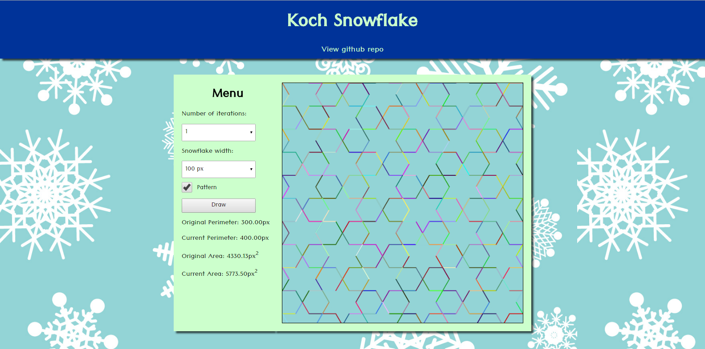
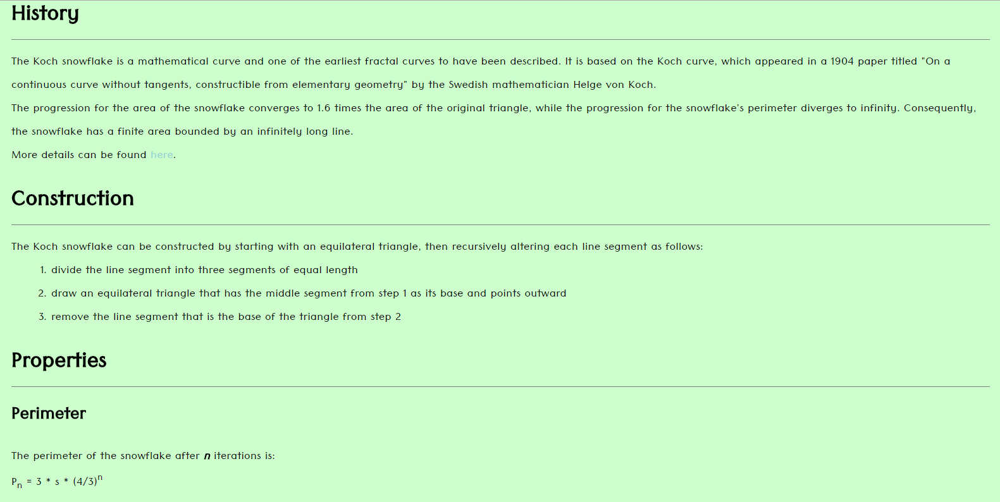

# Koch Snowflake

The Koch snowflake is a mathematical curve and one of the earliest fractal curves to have been described.

It can be constructed by starting with an equilateral triangle, then recursively altering each line segment as follows:
  1. divide the line segment into three segments of equal length
  2. draw an equilateral triangle that has the middle segment from step 1 as its base and points outward
  3. remove the line segment that is the base of the triangle from step 2

This page uses canvas and javascript to draw the Koch snowflake with a variety of iterations.

[Live][live]

[live]: https://jonathol.github.io/koch

## Features

* Menu
  * User can adjust the amount of iterations
  * A select tag allows users to change the dimension of the snowflake
  * Check box gives users the ability to create one or tessellate the     canvas with two different snowflake sizes
* Canvas
* Educational info
  * Provides a brief description on history, construction and properties
  * Links to Wiki page for more in depth details

## Languages, Frameworks, Libraries, Etc.

* Javascript
* HTML5 Canvas

## Screenshots

Menu and Canvas:

Information:

